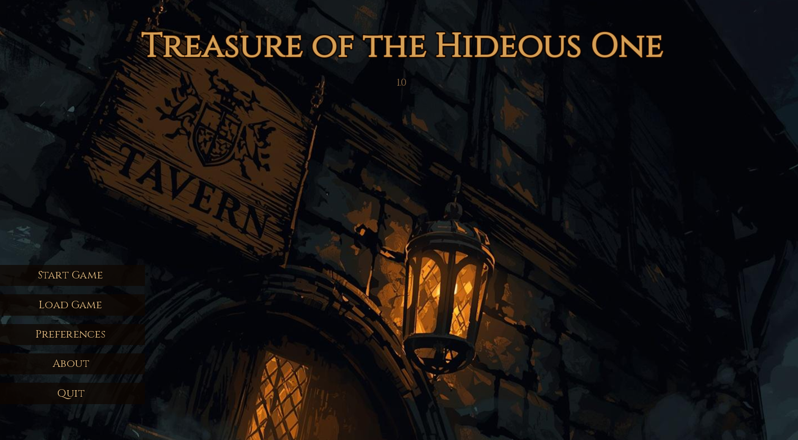

# Treasure of the Hideous One

> ⚠️ **AI-GENERATED ARTWORK NOTICE**  
> **ALL artwork in this game is AI-generated.** If you are allergic to or uncomfortable with AI-generated content, please do not download or play this game.

A Ren'Py visual novel adaptation of *AC2: Treasure of the Hideous One*, built as a dark D&D-style swamp adventure with branching narrative, companions, inventory, and d20 combat.

## Running the Game

Extract the zip and run `Treasure of the Hideous One.exe`.

## License

This project is released under CC BY-NC-SA 4.0. See `LICENSE`.

## Credits

- Based on *AC2: Treasure of the Hideous One* by David Cook
- Original adventure inspiration credited in-game